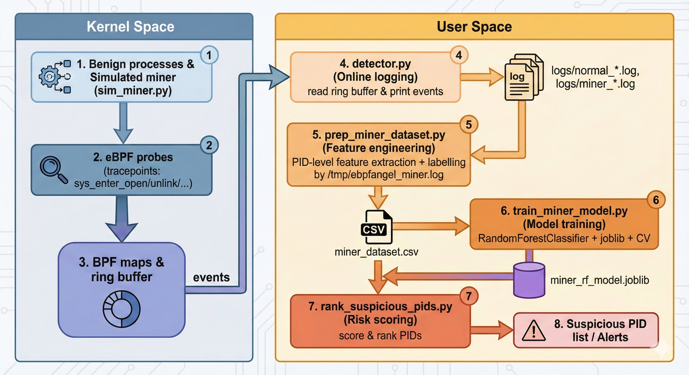

<a href="https://ebpfangel.philippart.me/">
<picture aling="center">
  <source media="(prefers-color-scheme: dark)" srcset="docs/assets/ebpfangel-logo-white.png">
  
</picture>
</a>


---

# ebpfangel-cryptomining: eBPF-based Cryptomining Detection

It extends the original [ebpfangel](https://github.com/TomasPhilippart/ebpfangel) ransomware
detection system to detect **cryptomining / cryptojacking processes** on Linux using eBPF and
machine learning.

> ⚠️ **Research / teaching only**  
> This is a proof-of-concept prototype and **not** a production-ready security product.
> It is intended for experimentation and education.

---

## Overview / Architecture



---


## 1. Based on: ebpfangel

The original project **ebpfangel** was developed by  
[Max Willers](https://www.linkedin.com/in/max-willers-53830b268) and  
[Tomás Philippart](https://www.linkedin.com/in/tomasphilippart/).  

- Upstream repo: <https://github.com/TomasPhilippart/ebpfangel>  
- Paper: `Ransomware Detection using Machine Learning with eBPF Angel`  
- License: MIT (see `LICENSE` in this repo).

ebpfangel is a ransomware detection system that uses:

- eBPF probes attached to file-related syscalls and crypto functions,
- a user-space detector collecting events via a ring buffer,
- a machine learning pipeline to classify ransomware vs benign processes.

For a full overview, please refer to the upstream README and paper.

---

## 2. What is added in this fork?

This fork focuses on **cryptomining (cryptojacking) detection** rather than ransomware.
The main additions are:

1. **Simulated miner workload**

   - `simulator/sim_miner.py`  
   - CPU-intensive SHA-256 loop + frequent log writes to `/tmp/ebpfangel_miner.log` +
     local TCP connection attempts.  
   - Used as a safe stand-in for real-world mining malware in a teaching environment.

2. **New dataset construction & labelling**

   - `machinelearning/prep_miner_dataset.py`  
   - Parses `logs/normal_*.log` and `logs/miner_*.log` generated by `detector.py`.  
   - Aggregates events **per PID** and builds features such as:
     `total_events`, `open_count`, `unique_files`, `open_ratio`, `events_per_ts`.  
   - Labels a PID as `miner` if it ever accesses `/tmp/ebpfangel_miner.log`.

3. **Cryptominer classifier**

   - `machinelearning/train_miner_model.py`  
   - Trains a `RandomForestClassifier` on the PID-level dataset
     (`miner_dataset.csv`) with class balancing and 5-fold cross validation.  
   - Outputs metrics (confusion matrix, classification report) and feature importances.  
   - Saves the model as `miner_rf_model.joblib`.

4. **Suspicious PID ranking (risk scoring)**

   - `machinelearning/rank_suspicious_pids.py`  
   - Loads `miner_dataset.csv` and the trained RF model.  
   - Computes a `miner_score` = P(class=miner) for each PID and prints a
     Top-K list of the most suspicious processes (PID, label, score, event stats).  

5. **Course report & diagrams**

   - `docs/` (optional) may include the course report in Markdown/PDF,  
     as well as a high-level architecture diagram for the cryptomining detection pipeline.

---

## 3. Architecture (high-level)

```text
Kernel Space:
  Benign processes + simulated miner (sim_miner.py)
    -> eBPF probes (tracepoints: sys_enter_open/unlink/...)
      -> BPF maps & ring buffer

User Space:
  detector.py  -> logs/normal_*.log, logs/miner_*.log
    -> prep_miner_dataset.py  -> miner_dataset.csv
      -> train_miner_model.py -> miner_rf_model.joblib
      -> rank_suspicious_pids.py -> Suspicious PID list / Alerts
````

See `docs/` or `figs/my-system-arch.png` for a graphical overview.

---

## 4. Quick start (for this fork)

> Tested on Ubuntu 22.04, kernel 5.15, with root privileges and BCC installed.

1. Clone this fork and prepare the Python environment:

   ```bash
   git clone git@github.com:<YourUserName>/ebpfangel-miner.git
   cd ebpfangel-miner
   python3 -m venv --system-site-packages venv
   source venv/bin/activate
   pip install -r requirements.txt  # or: pip install pandas scikit-learn matplotlib joblib
   ```

2. Run the detector and collect logs:

   ```bash
   cd detector
   # Normal workload
   python detector.py > ../logs/normal_1.log   # Ctrl+C after some time

   # Miner workload (in another terminal)
   cd ../
   python simulator/sim_miner.py               # Ctrl+C after 60–120s
   ```

   Repeat to build multiple `normal_*.log` and `miner_*.log` files if desired.

3. Build the dataset and train the model:

   ```bash
   cd machinelearning
   python prep_miner_dataset.py
   python train_miner_model.py
   ```

4. Rank suspicious PIDs:

   ```bash
   python rank_suspicious_pids.py
   ```

---

## 5. Disclaimer

This repository is intended **for research and teaching only**.
The simulated miner workload is designed to avoid running real malicious code on shared
infrastructure. Do **not** use this code as-is in production environments.

---

## 6. License

This project reuses and extends code from [TomasPhilippart/ebpfangel](https://github.com/TomasPhilippart/ebpfangel),
which is licensed under the MIT License.
All modifications in this fork are also released under the MIT License.
See [`LICENSE`](./LICENSE) for details.


